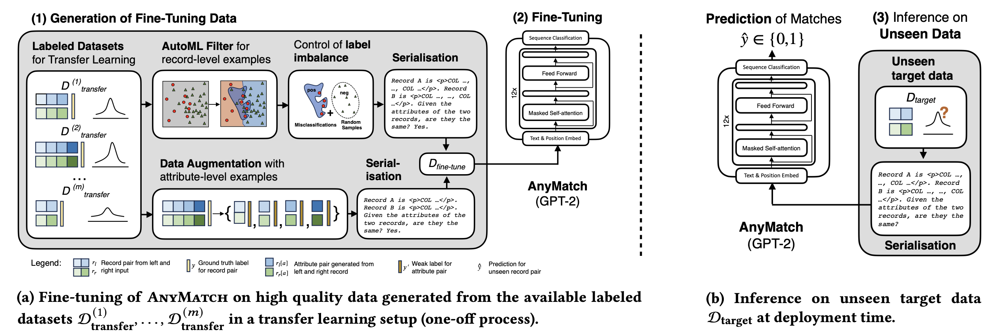

# AnyMatch – Efficient Zero-Shot Entity Matching with a Small Language Model


This repository contains the implementation of the entity matching solution presented in "AnyMatch – Efficient Zero-Shot Entity Matching
with a Small Language Model".

## Instructions for Using AnyMatch

### 1. Install dependencies

Create a conda environment with the provided file, then activate it:

```sh
conda env create -f environment.yml
conda activate anymatch
```

### 2. Download the raw data

Download the nine raw datasets from their respective sources and place them in the `data/raw` directory. For more detailed instructions, refer to `data/raw/readme.md`.

### 3. Prepare the datasets

Follow the preparation steps in the `data/preprocess.ipynb` notebook to preprocess the raw data and generate the record-level and attribute-level datasets.

### 4. Fine-tune and evaluate a model for the experiment in Section 6.1

The following script can be used to train a matcher by excluding the DATASET_NAME dataset and will evaluate the predictive quality of the trained model:
```sh
python loo.py \
    --seed 42 \
    --base_model gpt2 \
    --leaved_dataset_name DATASET_NAME \
    --serialization_mode mode1 \
    --train_data attr+row \
    --patience_start 20
```


### 5. Evaluate the inference throughput in Section 6.2

The inference throughput experiment can be run using the following script:
```sh
python throughput.py
```

### 6. Abaltion study in Section 6.3 (the scripts are organized in the same order as in Table5)
* the choice of base model 
```sh
python loo.py --leaved_dataset_name DATASET_NAME --base_model t5-base
python loo.py --leaved_dataset_name DATASET_NAME --base_model bert-base
```
* the choice of serialization mode
```sh
python loo.py -leaved_dataset_name DATASET_NAME --serialization_mode mode4
python loo.py -leaved_dataset_name DATASET_NAME --serialization_mode mode2
python loo.py -leaved_dataset_name DATASET_NAME --serialization_mode mode3
```
* the choice of training data generation strategy
```sh
python loo.py -leaved_dataset_name DATASET_NAME --row_sample_func automl_filter --train_data attr+row
python loo.py -leaved_dataset_name DATASET_NAME --row_sample_func one_pos_two_neg --train_data attr+row
python loo.py -leaved_dataset_name DATASET_NAME --row_sample_func one_pos_two_neg --train_data attr-row
python loo.py -leaved_dataset_name DATASET_NAME --row_sample_func one_pos_two_neg --train_data row
```

---

## Locate the main components of the AnyMatch implementation

### 1. AutoML filter & Label imbalance
The AutoML filter and label imbalance functionality are implemented in the `automl_filter` method of the `utils/data_utils.py` file. For simplicity in conducting experiments, we directly load the results after applying an AutoML model. Details on using such model can be found in `data/preprocess.ipynb`.

### 2. Serialisation
The serialization step can be found in the `df_serializer` method in `utils/data_utils.py`. Different modes can be selected by specifying the `mode` argument.

### 3. Model training & inference
The `train` and `inference` method can be found in the `utils/train_eval.py` file.


---

### Baselines and Data Analysis

For the baseline implementation and data analysis, please check out the following repos:

* StringSim: found in `string_similarity.py`
* ZeroER: https://github.com/mohamedyd/rein-benchmark/tree/master/cleaners/zeroer 
* Ditto: https://github.com/megagonlabs/ditto
* Jellyfish: https://huggingface.co/NECOUDBFM/Jellyfish-13B
* MatchGPT: https://github.com/wbsg-uni-mannheim/MatchGPT/tree/main/LLMForEM

---

We also provide the pretrained model weights, which are available [here](https://drive.google.com/drive/folders/1DpjXyCws02Tj9gvo4xNqhBhImSr7Cpgm?usp=drive_link).
